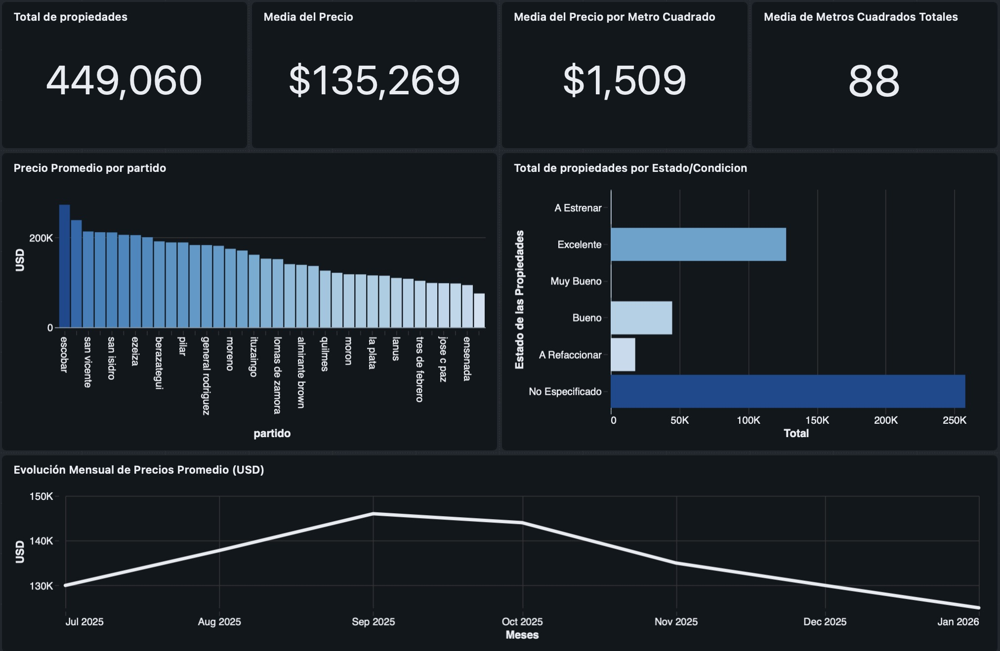
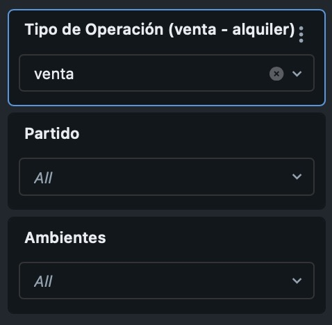

<p align="right">
  <a href="README.es.md">Versión en Español</a>
</p>

# Real Estate Lakehouse Platform (Argentina Market)

End-to-end Data Engineering Lakehouse implementation built on **Databricks**, **Delta Lake**, and **Apache Spark**. The pipeline ingests, cleans, models, and orchestrates over 1,200,000 real estate property listings across the Buenos Aires Metropolitan Area (CABA and GBA), delivering a business-ready dimensional model (Star Schema) and an executive dashboard.

---

## Architecture Overview

The platform implements a classic **Medallion Architecture (Bronze $\rightarrow$ Silver $\rightarrow$ Gold)** with Unity Catalog governance and an analytics semantic layer:

    [ Landing Zone / Volumes ]
        │
        ▼
    [ BRONZE ]  Raw Delta Table (batch ingestion, append/overwrite, schema enforcement)
        │
        ▼   
    [ SILVER ]  Cleaned & Enriched (currency standardization to USD, outlier removal via P05/P95, regex mapping)
        │
        ▼
    [ GOLD ]   Dimensional Model / Star Schema (Kimball: Fact + 4 Dimensions with Surrogate Keys)
        │
        ▼
    [ SEMANTIC ] Analytics Views (denormalized marts for BI consumption)
        │
        ▼
    [ PRESENTATION ] Databricks Lakehouse Dashboards & BI Reporting

---

## Pipeline Stages & Data Engineering Highlights

### 1. Ingestion (Bronze Layer)
* Ingestion of batch CSV datasets into an external Delta Lake table managed by Unity Catalog.
* Explicit schema enforcement to prevent type drift while preserving raw lineage.
* Full idempotency using `INSERT OVERWRITE` patterns.

### 2. Data Cleaning, EDA & Feature Engineering (Silver Layer)
* **Statistical Outlier Handling:** Evaluated property price distributions and trimmed anomalous tails using 5th and 95th percentiles ($P_{05} / P_{95}$) per zone and property type.
* **Currency Normalization:** Unified heterogeneous listings (ARS and USD) into standard USD equivalents applying daily market benchmark rates (FX: 1520 ARS/USD).
* **Robust Geographic Parsing:** Replaced brittle multi-branch matching with tokenized `LIKE` and regex parsing across 30+ municipalities across CABA and GBA (North, West, South).
* **Data Typing & Deduplication:** Cleansed corrupted categorical strings, cast numeric types safely with `TRY_CAST`, and purged cross-listing duplicates via Composite Hash keys.

### 3. Dimensional Modeling (Gold Layer - Kimball Star Schema)
Structured an analytical star schema optimized for fast aggregations and dashboard slice-and-dice:

* **`fact_propiedades`:** Granular fact table storing core additive metrics (`precio_usd`, `expensas_usd`, `precio_por_m2`, `m2_totales`, `ambientes`), tracked with a unique MD5 hash surrogate key (`row_hash`). Optimized via liquid clustering (`CLUSTER BY (fecha_id, zona_id)`).
* **`dim_zona`:** Geographic hierarchy (`partido`, `region`, `ciudad`, `provincia`, `pais`).
* **`dim_tiempo`:** Granular calendar table (`fecha_id` formatted as `YYYYMMDD`, `anio`, `mes`, `anio_mes`, `trimestre`, flags for weekends).
* **`dim_tipo_operacion`:** Operation context (`alquiler`, `venta`).
* **`dim_caracteristicas`:** Junk dimension grouping low-cardinality flags (`estado`, `cochera`) to avoid foreign key proliferation on the fact table.

### 4. Semantic Layer
* Created abstraction views (`vw_propiedades_analytics`, `vw_mercado_por_zona`) to decouple dashboard reporting and business consumers from underlying join complexities.

---

## Executive Lakehouse Dashboard

Built natively within Databricks Lakehouse Dashboards, providing real-time slicing by geographic region, transaction type, and property attributes.




### Key Market Takeaways:
* **Market Sample:** 449,060 qualified listings indexed.
* **Average Property Value:** $135,269 USD.
* **Average Price per Square Meter:** $1,509 USD/m².
* **Average Unit Size:** 88 m².

---

## Orchestration & Pipeline Automation

The entire pipeline is orchestrated via **Databricks Workflows** as an automated DAG (Directed Acyclic Graph):

            [ Task: etl_bronze ]
                      │
                      ▼
            [ Task: etl_silver ]
                      │
        ┌─────────────┼─────────────┬─────────────┐
        ▼             ▼             ▼             ▼
    [dim_zona]  [dim_tiempo]  [dim_tipo]  [dim_caract]
        └─────────────┬─────────────┴─────────────┘
                      │ (Parallel Execution)
                      ▼
            [ Task: etl_gold_fact ]


* **Decoupled Architecture:** Schema definitions (DDLs) are decoupled from ingestion runs (ETLs), preventing metadata locking in production.
* **Parallel Execution:** Gold dimension tables run simultaneously after Silver completion, cutting overall DAG execution runtime.
* **Event-Driven Design:** Configured to leverage **File Arrival Triggers** on Unity Catalog Volumes for hands-off reactive execution upon new data drops.

---

## Tech Stack

* **Storage & Engine:** Databricks, Apache Spark, Delta Lake.
* **Data Governance:** Unity Catalog (Catalogs, Schemas, Volumes).
* **Data Modeling:** Dimensional Modeling (Star Schema, Kimball methodology).
* **Languages:** SQL, PySpark.
* **Orchestration:** Databricks Workflows (DAGs, dependencies, triggers).
* **Visualization:** Databricks Lakehouse Dashboards.
* **Version Control:** Git, GitHub.

---

## Project Structure

```text
├── docs/
│   └── img/
│       └── dashboard.png               # Executive dashboard screenshot
│       └── filters.png                 # Filter Section Screenshot
├── sql/
│   ├── ddl/
│   │   ├── 01_bronze.sql               # Bronze layer table definition
│   │   ├── 02_silver.sql               # Silver layer table definition
│   │   └── 03_gold.sql                 # Star schema DDL (Dims + Fact)
│   ├── etl/
│   │   ├── 01_bronze.sql               # Bronze ingestion logic
│   │   ├── 02_silver.sql               # Silver transformations & cleaning
│   │   └── 03_gold.sql                 # Gold loading & surrogate keys
│   └── views/
│       └── 01_semantic_views.sql       # Analytical consumption layer
├── .gitignore                          # Standard ignore file
└── README.md                           # Project technical documentation
